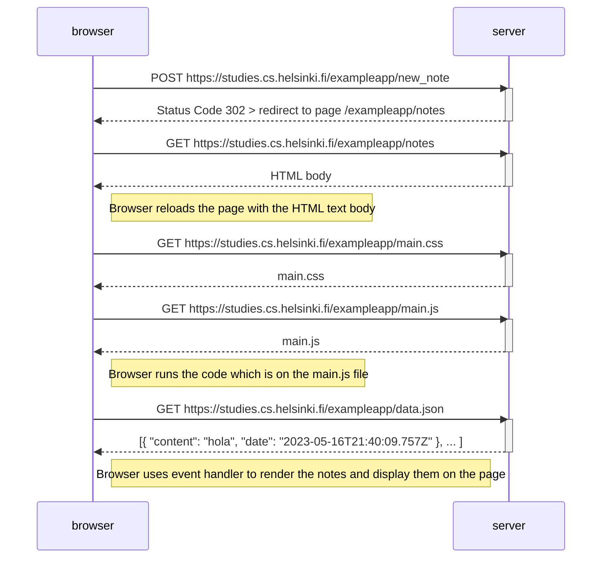

```mermaid
sequenceDiagram
    participant browser
    participant server
    
    browser->>server: POST https://studies.cs.helsinki.fi/exampleapp/new_note
    activate server
    server-->>browser: Status Code 302 > redirect to page /exampleapp/notes
    deactivate server
    
    browser->>server: GET https://studies.cs.helsinki.fi/exampleapp/notes
    activate server
    server-->>browser: HTML body
    deactivate server
    
    Note right of browser: Browser reloads the page with the HTML text body   
    
    browser->>server: GET https://studies.cs.helsinki.fi/exampleapp/main.css
    activate server
    server-->>browser: main.css
    deactivate server
    
    browser->>server: GET https://studies.cs.helsinki.fi/exampleapp/main.js
    activate server
    server-->>browser: main.js
    deactivate server
    
    Note right of browser: Browser runs the code which is on the main.js file
    
    browser->>server: GET https://studies.cs.helsinki.fi/exampleapp/data.json
    activate server
    server-->>browser: [{ "content": "hola", "date": "2023-05-16T21:40:09.757Z" }, ... ]
    deactivate server    

    Note right of browser: Browser uses event handler to render the notes and display them on the page
```
